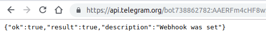
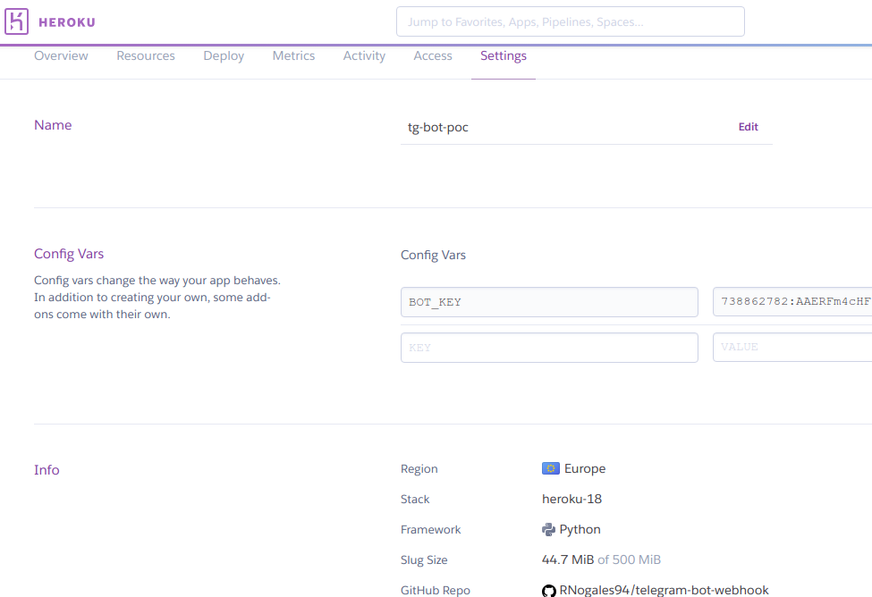

# telegram-bot-webhook
Prueba de concepto de un bot de Telegram accionado por WebHooks

Para poner este bot en funcionamiento lo único que hay que hacer es tener un bot de telegram (llamando al botfather etc..)

También necesitas que tu bot esté configurado para usar un webhook en el lado de Telegram, hay mucha documentación al respecto, pero en resumen basta con entrar a este link (hay que rellenar los campos antes de entrar):

https://api.telegram.org/bot<BOT_TOKEN>/setWebHook?url=<TU_URL_DE_HEROKU>

Estoy dando por hecho que lo vas a desplegar en heroku, pero puedes desplegarlo donde quieras, si lo despliegas en Heroku ya estaría listo (para eso sirve el procfile)

Solo tendras que añadir tu BOT_TOKEN a una variable de entorno en heroku (en el dashboard de heroku)

